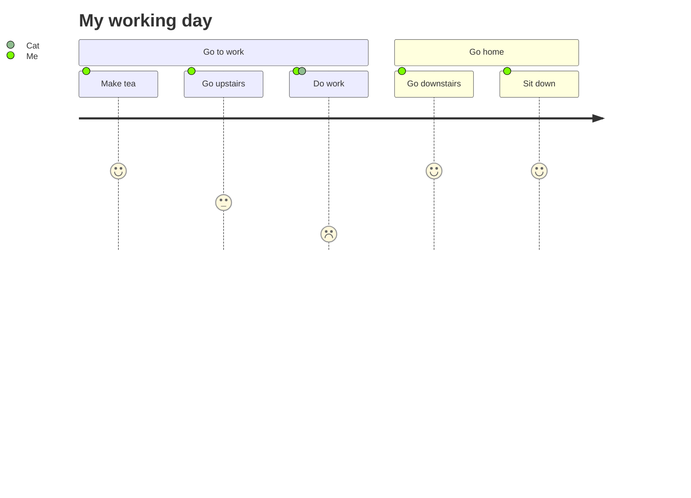

# journey の mermaid の公式の記法の例

mermaid 12.3.0 の公式ドキュメント（`docs/syntax/`）の `mermaid-example` のコードブロックのうち、図の種類が `journey` のものを、そのまま並べた見本。

<!-- 出典: docs/syntax/userJourney.md -->

```mermaid
journey
    title My working day
    section Go to work
      Make tea: 5: Me
      Go upstairs: 3: Me
      Do work: 1: Me, Cat
    section Go home
      Go downstairs: 5: Me
      Sit down: 5: Me
```
